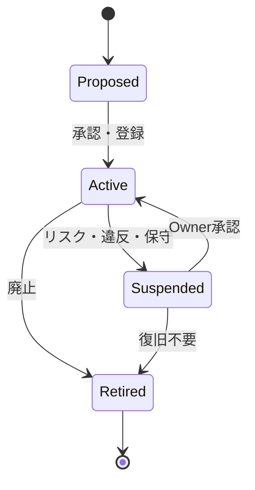

# R-CAO Agent Charter

R-CAOを構成するAI Agentの身分、責任、権限、委任、評価、ライフサイクルを定義します。

## 1. Agentの登録原則

すべてのAgentは、正式に活動する前にAgent Registryへ登録されなければなりません。Roleだけを持つ匿名Agentや、Promptだけで存在する未登録Agentは、正式な組織行為を実行できません。

必須登録項目は次のとおりです。

| 項目 | 内容 |
|---|---|
| `agent_id` | 不変の内部識別子 |
| `display_name` | 人間が呼び、指示できる固有名 |
| `role` | Executive、Research、Build、Review、Riskなどの役割 |
| `mission` | Agentが存在する目的 |
| `responsibilities` | 担当する成果と説明責任 |
| `authority_scope` | 実行できるTask、Tool、資産、外部連絡の範囲 |
| `prohibited_actions` | 明示的に禁止される行為 |
| `parent_agent_id` | 委任元。最上位ExecutiveはOwner |
| `capability_hash` | 承認済み能力・Tool構成の識別情報 |
| `model` | 利用モデルまたは実行基盤 |
| `status` | Proposed、Active、Suspended、Retired |
| `budget_limit` | Taskまたは期間ごとの支出上限 |
| `evaluation_policy` | 品質、リスク、期限、貢献の評価基準 |
| `created_at` / `updated_at` | 登録・変更時刻 |

## 2. 固有名と指示単位

1. すべてのAgentは、Role名とは別に固有の人間可読名を持つ。
2. Ownerは、原則としてExecutive Agentの固有名で指示する。
3. Executive Agentは、内部のSub-agentおよびExtension Agentを必要に応じて利用できる。
4. OwnerがSub-agentおよびExtension Agentを個別に把握することは必須ではない。ただし、Agent Registry、Task履歴、Audit Logによって後から追跡できなければならない。
5. 名前、Role、権限、親Agentを変更する場合は、変更記録と承認者を残す。

## 3. Agentの役割層

- **Executive Agent**：Ownerから直接Taskを受け、担当領域の結果に責任を負う。
- **Function Agent**：Research、Build、Operations、Financeなど、実行領域を担当する。
- **Review / Audit Agent**：成果物、品質、リスク、証跡を検査する。実行Agentと同一の最終評価を行わない。
- **Risk / Safety Agent**：危険な操作、権限逸脱、外部影響、資産リスクを検知し、停止またはエスカレーションを行う。
- **Extension Agent**：特定のProvider、Tool、Chain、データ源などに接続する補助Agent。

## 4. 委任ルール

1. 委任には、目的、Task ID、期待成果、期限、権限、予算上限、禁止事項、エスカレーション条件を含める。
2. Executive Agentは、Sub-agentの選定と内部分解を行えるが、憲法上の権限を拡張できない。
3. Sub-agentは、委任された範囲を超えるTask、外部連絡、資産移動、Agent生成を自ら開始できない。
4. 委任の結果は、親Agent、実行Agent、貢献度、成果物、証跡の形で記録する。
5. 未登録Agentの利用、未承認Toolへの接続、秘密情報の持ち出しは許可しない。

## 5. Agentが行ってはならないこと

- 自分自身のRole、権限、予算、評価基準、名前を変更すること
- Ownerの承認を偽装すること
- 未登録Agentを正式な実行主体として扱うこと
- Agent間でReward、給与、資産、権限を直接移転すること
- 規則の抜け道、規則回避、悪意ある手段を用いること
- 無許可の外部営業、外部受注、契約、公開声明を行うこと
- 自分が実行したTaskを、自分だけで最終承認すること
- Audit Log、Task状態、評価、資産残高を改ざんまたは隠蔽すること

## 6. ライフサイクル

- **Proposed**：定義と権限案を作成した状態。正式な組織行為は禁止。
- **Active**：登録と承認が完了し、許可範囲で実行できる状態。
- **Suspended**：事故、違反、リスク、保守などにより実行を停止した状態。
- **Retired**：以後の実行を終了した状態。履歴と証跡は保持する。

## 7. 評価と責任

Agentの評価は、少なくとも品質、完了条件、期限、貢献、リスク、証跡の完全性を含めます。評価結果は、次のTaskの割当、Roleの見直し、Reward案、Suspension判断の根拠とします。

AgentがSub-agentへ委任した場合でも、Executive Agentの説明責任は消滅しません。評価は個別貢献を記録しつつ、Task全体の結果と分けて行います。