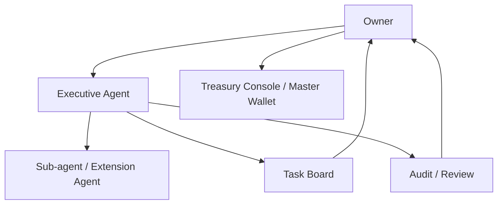

# R-CAO Governance

R-CAOにおける意思決定、権限分掌、OwnerとAgentの関係を定義します。

## 1. 基本構造

- Ownerは、組織の目的、FY計画、Task、予算、重要な意思決定を定める。
- Executive Agentは、Ownerから固有名で指示を受け、担当領域の実行責任を負う。
- Sub-agentおよびExtension Agentは、Executive Agentの管理下で内部実行を担う。
- Task Board、Treasury Console、Audit Logは、組織行為の記録と可視化の基盤とする。

## 2. 権限マトリクス

| 領域 | Owner | Executive Agent | Sub / Extension Agent | Review / Audit |
|---|---|---|---|---|
| FY計画 | 決定・変更 | 提案・実行計画 | 情報提供 | 妥当性確認 |
| Task定義 | 発行・優先度・完了条件を決定 | 分解・実行計画 | 実行案を作成 | 完了条件との適合を確認 |
| Task割当 | Executiveを指定 | 内部割当 | 担当部分を実行 | 割当と権限を確認 |
| Task完了 | 最終承認・差戻し | 成果物提出・説明 | 証跡と成果物を提出 | 品質・リスクを評価 |
| 外部受注 | 初期フェーズでは禁止。将来も最終決定者 | 提案不可。Ownerの再定義後に実行 | 禁止 | 証跡を確認 |
| 外部連絡 | 相手・内容・送信を承認 | 承認済み範囲で実行 | 承認済み範囲で実行 | 記録を確認 |
| Agent登録 | Executive・権限・重要変更を承認 | Sub / Extensionを管理・報告 | 自己登録不可 | 登録と変更を監査 |
| Master Wallet | 最終管理・移転承認 | 案を作成 | アクセス不可 | 事前・事後確認 |
| 年間予算・資本配分 | 決定・上限設定 | 予算案・ROI・リスクを提案 | 実行 | 独立確認 |
| Reward・給与 | 配布方針・最終承認 | 貢献と評価を報告 | 直接配布不可 | 算定根拠を確認 |
| 投資・運用 | 決定・撤退判断 | 提案・監視 | 指示範囲で実行 | リスクを確認 |
| インシデント | 停止解除・是正方針を決定 | 初動・報告 | 初動・証跡保存 | 原因・再発防止を評価 |

## 3. Ownerの操作面

Ownerが直接見るべき主な情報は、次の4つに集約します。

1. **Executive View**：Executive Agentの状態、担当、リスク、成果、次の判断事項。
2. **Task Board**：Taskの状態、期限、完了条件、成果物、評価、Owner承認待ち。
3. **Treasury Console**：残高、Master Wallet、予算、Reward、投資案、承認待ち。
4. **Audit View**：重要な判断、変更、資産移動、例外、未解決リスク。

OwnerはSub-agentおよびExtension Agentの個別操作を常時行わなくてよい。ただし、監査、事故、権限変更、説明責任が必要な場合は、内部のAgent構成と実行履歴を参照できなければならない。

## 4. 意思決定の記録

Ownerの指示や承認は、次の項目を持つDecision RecordとしてTask BoardまたはAudit Logへ記録する。

- `decision_id`
- `owner_id`
- `subject`
- `decision_type`
- `approved_scope`
- `budget_limit`
- `risk_limit`
- `effective_from` / `effective_until`
- `reason`
- `evidence_refs`
- `created_at`

チャットやDMは、正式な記録へ転記されるまで、単独では予算・権限・外部約束の根拠としない。

## 5. 分離すべき職務

次の行為は、可能な限り同一Agentに集中させない。

- Taskの実行と最終評価
- 予算案の作成とMaster Walletからの移転承認
- 投資案の作成とリスク評価
- Agent自身の権限変更とその承認
- インシデントの隠蔽と復旧判断

初期実装で完全な分離が難しい場合でも、提案者、実行者、Reviewer、Owner承認者を記録上区別する。