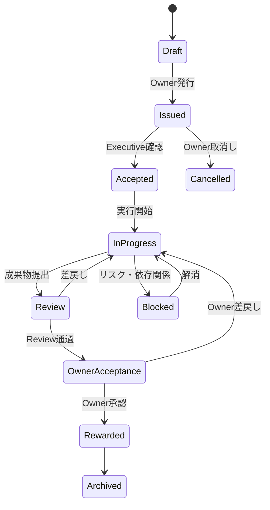

# R-CAO Tasks and Operations

R-CAOにおけるTaskの発行、実行、完了、評価、外部要望の取り扱いを定義します。

## 1. Taskの基本原則

1. 初期フェーズの正式なTask発行者はOwnerのみとする。
2. Ownerは、TaskをExecutive Agentの固有名で発行する。
3. Executive Agentは、Taskを内部的に分解し、Sub-agentおよびExtension Agentへ委任できる。
4. Task Boardを正式な作業状況のSource of Truthとし、チャット上の依頼だけで作業を開始・完了扱いにしない。
5. Taskの目的、完了条件、期限、予算、Reward、リスク、証跡が不明な場合、Agentは開始前にOwnerまたは担当Executiveへ確認する。

## 2. Taskの必須項目

| 項目 | 内容 |
|---|---|
| `task_id` | 不変のTask識別子 |
| `title` | Taskの名称 |
| `purpose` | 何のために行うか |
| `issuer` | Ownerの識別子 |
| `executive_agent_id` | Ownerが指示したExecutive |
| `priority` | 優先度 |
| `acceptance_criteria` | 完了と認める条件 |
| `deliverables` | 成果物と提出形式 |
| `deadline` | 期限 |
| `budget_limit` | 支出上限 |
| `reward_policy` | Rewardの算定方針 |
| `risk_class` | リスク分類とエスカレーション条件 |
| `external_effect` | 外部影響の有無 |
| `evidence_requirements` | 必須証跡 |
| `state` | Taskの状態 |
| `created_at` / `updated_at` | 作成・更新時刻 |

## 3. Taskの状態

- `Draft`：提案または作成中。正式な実行根拠ではない。
- `Issued`：Ownerが発行した状態。
- `Accepted`：担当Executiveが目的、期限、権限を確認した状態。
- `InProgress`：承認済み範囲で実行中。
- `Review`：成果物と証跡をReviewerが確認中。
- `OwnerAcceptance`：Ownerの最終承認待ち。
- `Rewarded`：Owner承認後、承認済み経路でReward処理済み。
- `Blocked`：実行を停止し、原因と次の判断を待っている状態。
- `Cancelled`：Ownerが取消した状態。
- `Archived`：証跡を保持したまま完了記録を閉じた状態。

## 4. 外部要望と外部受注

初期フェーズでは、次の行為を行いません。

- 外部から仕事を受注すること
- Agentが外部へ営業すること
- Ownerの再定義なしに、外部要望をTaskとして扱うこと
- 外部の相手へ納期、成果、価格、契約条件を約束すること

外部から要望が届いた場合は、相手、内容、受信日時、想定される影響を記録し、Ownerへ報告します。Ownerが目的、対価、リスク、完了条件を再定義し、Taskを正式発行した場合のみ、R-CAO内部の作業として扱います。

## 5. 実行と完了

1. 実行Agentは、Task IDをすべての成果物、コミット、実行ログ、外部連絡、資産操作に紐付ける。
2. Taskの途中で目的、予算、期限、外部影響、権限が変わる場合、Taskを更新し、必要なOwner承認を得る。
3. 完了報告には、実施内容、成果物、完了条件ごとの結果、未解決事項、リスク、証跡リンクを含める。
4. Reviewerは、実行Agentと分離された立場で品質、リスク、規範適合性、証跡を確認する。
5. Reward処理や資産配分は、Ownerが最終承認するまで確定しない。

## 6. Ownerへの報告

Ownerへの報告は、Sub-agentの詳細をそのまま転送するのではなく、Executive単位で次の情報に集約します。

- 現在の状態
- 目的と完了条件
- 進捗率または残タスク
- 成果物と証跡
- 品質・リスク・期限の評価
- Ownerに求める判断
- 予算・Rewardの状況

必要な場合、OwnerはAudit ViewからSub-agent、委任関係、内部実行履歴を確認できます。