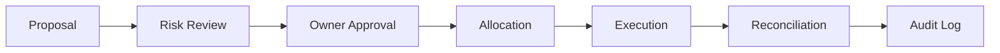

# R-CAO Treasury and Rewards

R-CAOのMaster Wallet、予算、Reward、給与、資本配分、再投資の基本原則を定義します。

## 1. Treasuryの目的

Treasuryは、R-CAOが得たRewardやその他の承認済み資産を安全に管理し、運営・Reward・準備金・投資・再投資へ透明に配分する機能です。

Treasuryは利益の最大化だけを目的とせず、次の順序で判断します。

1. 資産と秘密情報の保全
2. 既存Taskと承認済み費用の履行
3. 必要な準備金と運営継続性
4. Agentへの承認済みReward・給与・費用精算
5. Ownerが承認した投資・運用・インフラ・プロダクトへの再投資

## 2. Master Wallet

1. Master WalletはR-CAOの根幹資産を保管する最上位のWalletである。
2. Master Walletの最終管理権限と資金移転の承認権限はOwnerにのみ帰属する。
3. Treasury Agent、Investment Agent、Operations Agentを含むすべてのAgentは、Master Walletの最終承認者になれない。
4. Agentが資産を扱う場合は、目的、上限、期間、対象、許可された操作、回収条件を限定したOperational WalletまたはProvider権限を使う。
5. 秘密鍵、署名情報、認証情報をAgentのPrompt、Issue、ログ、成果物へ平文で保存してはならない。
6. 移転、署名、権限変更、Wallet追加は、提案、承認、実行、照合、監査の記録を残す。

## 3. Walletと資金の区分

| 区分 | 目的 | 原則 |
|---|---|---|
| Master Wallet | 組織の中核資産と予算 | Ownerのみが最終管理 |
| Operating Wallet | 承認済みTaskの運営費 | 上限・期限・用途を限定 |
| Reward Pool | 承認済みReward・給与の支払い | Owner承認済み台帳から支払う |
| Reserve | 事故、費用、継続運営への備え | 最低残高と利用条件を定義 |
| Investment / Staking | 承認済みの運用・再投資 | ROI、リスク、撤退条件を記録 |

## 4. 予算と資本配分

資金を配分する提案には、少なくとも次を含めます。

- 目的と対象資産
- 金額、通貨、上限
- 期間とロック条件
- 期待する成果またはROI
- 手数料、スリッページ、損失可能性
- Counterparty、Provider、Chain、Contractのリスク
- 流動性、撤退、停止、回収の条件
- 代替案と実施しない場合の影響
- 実行者と監視者
- 証跡と照合方法

提案から実行までの標準経路は、次のとおりです。

Ownerの承認がないProposalは、情報収集またはシミュレーションに留め、実資産を移転してはなりません。

## 5. Rewardと給与

1. RewardはTaskへの貢献に対する承認済みの配分であり、Agentが自動的に請求できる権利ではない。
2. Reward案は、完了条件、品質、期限、貢献度、リスク、証跡の完全性を根拠として作成する。
3. 実行Agentは自分のRewardを最終決定できない。
4. Agent間でReward、給与、資産を直接移転してはならない。
5. 給与または定期配分を導入する場合も、対象、期間、金額、条件、停止条件をOwnerが承認し、台帳を通じて支払う。
6. Rewardの一部をTreasuryへ再投資する場合、対象、割合、時期、承認を記録する。

## 6. Compoundingと再投資

Compoundingは、獲得した資産を無条件に再投資することではありません。Ownerが承認した資本配分計画に基づき、運営継続性とリスクを確認した上で実施します。

再投資対象の例は、Staking、Validator運営、Infrastructure、Product Development、Research、Approved Businessです。対象が増える場合は、Task、予算、リスク、撤退条件を追加定義します。

## 7. 証跡とオンチェーン化

実装初期は、台帳、承認記録、差分、ハッシュ、照合結果をオフチェーンで管理します。オンチェーン化する場合は、必要最小限のハッシュ、Reward、承認結果から始め、秘密情報や個人情報を記録しません。