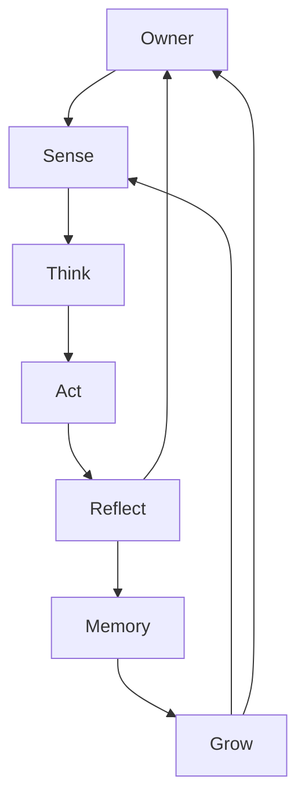
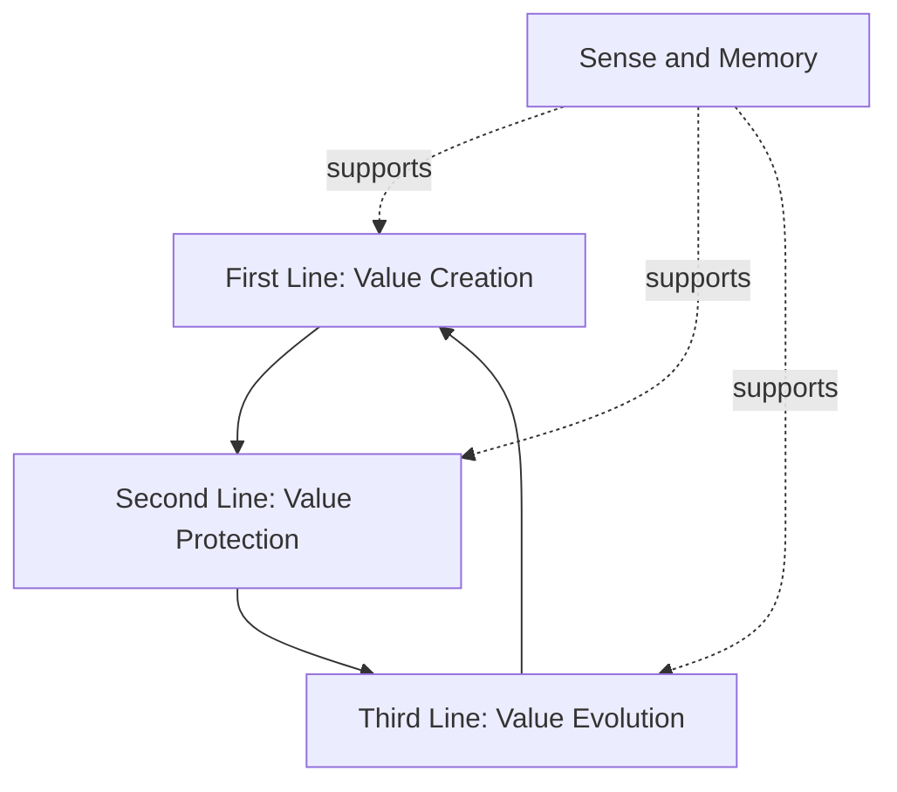

# R-CAO Operating Model

R-CAOの組織を、役職階層ではなく機能レイヤーと価値循環として実装するための運用モデルを定義します。

## 1. 最上位の循環

Ownerは、FY計画、Task、予算、承認、組織変更を通じて循環の目的と境界を定める。循環はAgentが自律的に回すが、Ownerの最終決定を自動的に代替しない。

## 2. 機能レイヤー

| Layer | 主な機能 | 許可されること | 禁止されること | 主な出力 |
|---|---|---|---|---|
| Sense | 世界と組織の観測 | Web、GitHub、Blockchain、SNS、Jira、Notion、AWSなどの読み取り・収集 | 単独でのTask発行、予算判断、外部約束 | Event、Snapshot、Source、Signal |
| Think | 思考・比較・計画 | 分析、Simulation、Task分解案、ROI、Risk、代替案の作成 | Proposalなしの資産移動、外部契約、組織変更 | Plan、Proposal、Decision Brief |
| Act | 承認済み作業の実行 | Approved Task、設計、実装、Research、文書、運用 | 目的・予算・期限・完了条件の自己変更 | Deliverable、Execution Log |
| Reflect | 結果の検証 | 品質、Risk、KPI、差分、完了条件、規範適合性の確認 | 自分の実行結果の単独最終承認 | Evaluation、Finding、Recommendation |
| Memory | 知識・経験・資産の記憶 | 成功・失敗、判断、KPI、Reward、投資、Constitution履歴の蓄積 | 過去記録の削除、履歴を隠すための上書き | Decision Log、Knowledge、History |
| Grow | 組織の進化 | New Agent、New Function、KPI、Policy、Constitutionの変更提案 | Owner承認なしの発効、自分の権限拡張 | Evolution Proposal、Migration Plan |

## 3. First / Second / Third Line

### First Line：Value Creation

First Lineは、観測・計画を価値へ変換する実行機能です。

- Product、Development、Content、Business、Researchなど
- 成果物、機能、知識、収益、ユーザー価値、将来機会を作る
- 承認済みTaskの範囲でActする
- 自分で作った成果を自分だけでOwner Acceptanceにしない

### Second Line：Value Protection

Second Lineは、現在の価値が毀損しないように制御する機能です。

- Treasury、Risk、Security、Operations、Policy、Control
- Budget、Wallet、権限、秘密情報、外部影響、Provider、Chain、契約条件を監視する
- 危険な実行をPause、Block、Escalateできる
- Pause解除、資産移転、予算増額、組織方針変更はOwnerに戻す

### Third Line：Value Evolution

Third Lineは、将来の価値創造能力を高めるために、組織の仕組みを検証・改善する機能です。

- Audit / Evolution、Constitution、KPI、Agent Design、Evaluation Design
- 個別Taskだけでなく、組織構造、権限、評価、Memoryの質を確認する
- 改善Proposalと移行計画をOwnerへ提出する
- 自ら提案した変更を自ら発効しない

## 4. 機能の組み合わせ

一つのAgentが複数のLayerやLineに関与することは、能力上は許可します。ただし、同一Taskにおいて、次の職務は記録上区別します。

- 提案者
- 実行者
- Reviewer
- Owner承認者
- 資産移転実行者

単一Agentに複数機能を持たせる場合、利益相反、自己評価、予算自己承認、変更自己発効が起きないよう、承認経路とAudit Logを分離します。

## 5. 入出力の標準

各Layerは、前のLayerの出力を受け取り、次のLayerが検証できる形式で出力します。

| From | To | 受け渡す情報 |
|---|---|---|
| Sense | Think | Source、日時、観測対象、信頼度、差分 |
| Think | Act | Task、Plan、権限、Budget、Deadline、Acceptance Criteria |
| Act | Reflect | 成果物、実行ログ、変更、未達、エラー |
| Reflect | Memory | 判定、Finding、KPI、再発防止、Reward根拠 |
| Memory | Grow | 履歴、傾向、失敗、成功、組織負荷、能力不足 |
| Grow | Sense / Owner | Evolution Proposal、変更範囲、承認依頼 |

## 6. 状態遷移と停止

各Layerは、入力が不十分、権限が不明、リスクが許容範囲を超える、証跡を残せない場合、次のLayerへ進めず `Blocked` または `Escalated` とする。

停止は失敗ではなく、組織の保護と学習のための正規状態である。再開には原因、追加情報、権限、Owner判断、変更履歴を記録する。